# Профилирование с Pprof

Задание состоит в оптимизации функции SlowSearch на основе данных от профилировщика

## Анализ кода

1) Читается весь контент файла за раз.
2) Используются регулярки для замены подстрок
3) Используеются регулярки для проверки вхождения строки (которые еще и создаются заново на каждой итерации)
4) После чтения контент приводится к стрингу и разрезается на отдельные строки, что наверное вызывает дополнительные аллокации
5) Увиденные браузеры хранятся в слайсе
6) Юзеры хранятся просто как мапа `interface{}`. Из-за этого потом приходится делать тайп ассерты, когда хотим достать какое-либо поле
7) Жсоны парсятся с использованием стандартной либы (причем строки для этого приводятся к `[]byte`)
8) Для проверки браузера на `Android` или `MSIE` делаются два полностью одинаковых цикла
9) В конце каждой итерации делается конкатенация строк

## Профилирование

Сначала нужно запустить бенчмарки, чтобы собрать профили CPU и памяти, а потом проанализировать их в `pprof`

### Бенчмарки

Запускаем:

```shell
go test -bench . -benchmem \
		-cpuprofile=cpu.out \
		-memprofile=mem.out \
		-memprofilerate=1 \
		.
```

Получаем результат:

```text
goos: darwin
goarch: arm64
pkg: stepikGoWebServices
cpu: Apple M2 Pro
BenchmarkSlow-12        
       4         312537188 ns/op        20214674 B/op     182811 allocs/op
PASS
ok      stepikGoWebServices     3.622s
```

### Анализ с помощью pprof

### CPU

Посмотрим часть графа CPU-профиля:

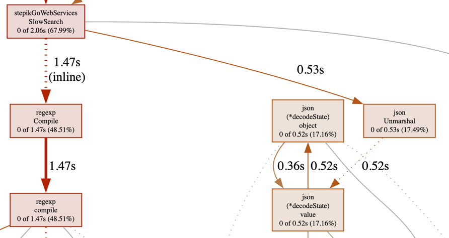

И еще флеймграф:

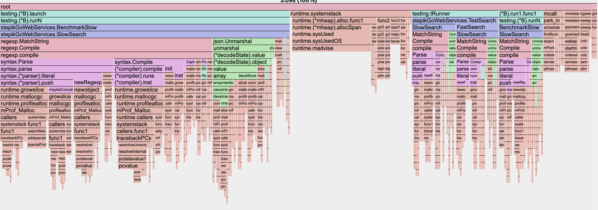

Как видно, единственными тяжелыми операциями является сборка регулярки и парсинг жсона. Причем компиляция регулярки занимает больше времени :/

Также можно посмотреть время, потраченное на исполнение каждой строки:
1) По какой-то причине профилировщик не показываем время чтения всего файла за раз
2) Как говорил ранее, больше всего времени уходит на маршалинг жсона и компиляцию регулярок

```text
ROUTINE ======================== stepikGoWebServices.SlowSearch in /Users/danilov6083/GolandProjects/stepikGoWebServices/3-profiling/slow_search.go
         0      2.18s (flat, cum) 70.55% of Total
         .          .     15:func SlowSearch(out io.Writer) {
         .       10ms     16:   file, err := os.Open(filePath)
         .          .     17:   if err != nil {
         .          .     18:           panic(err)
         .          .     19:   }
         .          .     20:
         .          .     21:   fileContents, err := io.ReadAll(file)
         .          .     22:   if err != nil {
         .          .     23:           panic(err)
         .          .     24:   }
         .          .     25:
         .          .     26:   reg := regexp.MustCompile("@")
         .          .     27:   var seenBrowsers = make([]string, 0)
         .          .     28:   uniqueBrowsers := 0
         .          .     29:   foundUsers := ""
         .          .     30:
         .          .     31:   lines := strings.Split(string(fileContents), "\n")
         .          .     32:
         .          .     33:   users := make([]map[string]interface{}, 0)
         .          .     34:   for _, line := range lines {
         .       50ms     35:           user := make(map[string]interface{})
         .          .     36:           //fmt.Printf("%v %v\n", err, line)
         .      480ms     37:           err := json.Unmarshal([]byte(line), &user)
         .          .     38:           if err != nil {
         .          .     39:                   panic(err)
         .          .     40:           }
         .          .     41:           users = append(users, user)
         .          .     42:   }
         .          .     43:
         .          .     44:   for i, user := range users {
         .          .     45:
         .          .     46:           isAndroid := false
         .          .     47:           isMSIE := false
         .          .     48:
         .          .     49:           browsers, ok := user["browsers"].([]interface{})
         .          .     50:           if !ok {
         .          .     51:                   log.Println("Cant cast browsers")
         .          .     52:                   continue
         .          .     53:           }
         .          .     54:
         .          .     55:           for _, browserRaw := range browsers {
         .          .     56:                   browser, ok := browserRaw.(string)
         .          .     57:                   if !ok {
         .          .     58:                           //log.Println("Cant cast browser to string")
         .          .     59:                           continue
         .          .     60:                   }
         .      920ms     61:                   if ok, err := regexp.MatchString("Android", browser); ok && err == nil {
         .          .     62:                           isAndroid = true
         .          .     63:                           notSeenBefore := true
         .          .     64:                           for _, item := range seenBrowsers {
         .          .     65:                                   if item == browser {
         .          .     66:                                           notSeenBefore = false
         .          .     67:                                   }
         .          .     68:                           }
         .          .     69:                           if notSeenBefore {
         .          .     70:                                   //log.Printf("SLOW New browser: %s, first seen: %s\n", browser, user["name"])
         .          .     71:                                   seenBrowsers = append(seenBrowsers, browser)
         .          .     72:                                   uniqueBrowsers++
         .          .     73:                           }
         .          .     74:                   }
         .          .     75:           }
         .          .     76:
         .          .     77:           for _, browserRaw := range browsers {
         .          .     78:                   browser, ok := browserRaw.(string)
         .          .     79:                   if !ok {
         .          .     80:                           //log.Println("cant cast browser to string")
         .          .     81:                           continue
         .          .     82:                   }
         .      700ms     83:                   if ok, err := regexp.MatchString("MSIE", browser); ok && err == nil {
         .          .     84:                           isMSIE = true
         .          .     85:                           notSeenBefore := true
         .          .     86:                           for _, item := range seenBrowsers {
         .          .     87:                                   if item == browser {
         .          .     88:                                           notSeenBefore = false
         .          .     89:                                   }
         .          .     90:                           }
         .          .     91:                           if notSeenBefore {
         .          .     92:                                   //log.Printf("SLOW New browser: %s, first seen: %s\n", browser, user["name"])
         .          .     93:                                   seenBrowsers = append(seenBrowsers, browser)
         .          .     94:                                   uniqueBrowsers++
         .          .     95:                           }
         .          .     96:                   }
         .          .     97:           }
         .          .     98:
         .          .     99:           if !(isAndroid && isMSIE) {
         .          .    100:                   continue
         .          .    101:           }
         .          .    102:
         .          .    103:           //log.Println("Android and MSIE user:", user["name"], user["email"])
         .       10ms    104:           email := reg.ReplaceAllString(user["email"].(string), " [at] ")
         .       10ms    105:           foundUsers += fmt.Sprintf("[%d] %s <%s>\n", i, user["name"], email)
         .          .    106:   }
         .          .    107:
         .          .    108:   fmt.Fprintln(out, "found users:\n"+foundUsers)
         .          .    109:   fmt.Fprintln(out, "Total unique browsers", len(seenBrowsers))
         .          .    110:}
```

#### Memory

Далее посмотрим на граф памяти:

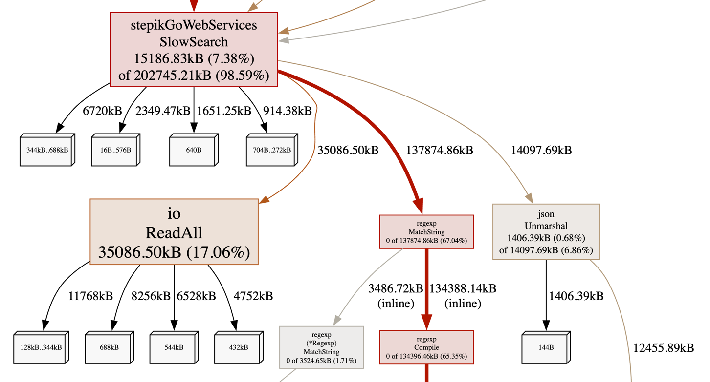

И еще флеймграф:

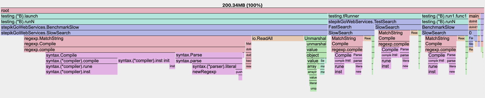

1) Тяжелыми операциями являются компиляция регулярок, чтение файла и маршалинг жсонов
2) Наглядно видно, что компиляция регулярок съедает намного больше памяти, чем все остальное

И снова посмотрим построчно. Видны еще интересные аллокации:
1) При разделение контента файла на отдельные строки
2) При конкатенации строк

```text
ROUTINE ======================== stepikGoWebServices.SlowSearch in /Users/danilov6083/GolandProjects/stepikGoWebServices/3-profiling/slow_search.go
   14.29MB   197.53MB (flat, cum) 98.60% of Total
         .          .     15:func SlowSearch(out io.Writer) {
         .     1.25kB     16:   file, err := os.Open(filePath)
         .          .     17:   if err != nil {
         .          .     18:           panic(err)
         .          .     19:   }
         .          .     20:
         .    34.09MB     21:   fileContents, err := io.ReadAll(file)
         .          .     22:   if err != nil {
         .          .     23:           panic(err)
         .          .     24:   }
         .          .     25:
         .     7.58kB     26:   reg := regexp.MustCompile("@")
         .          .     27:   var seenBrowsers = make([]string, 0)
         .          .     28:   uniqueBrowsers := 0
         .          .     29:   foundUsers := ""
         .          .     30:
    6.02MB     6.17MB     31:   lines := strings.Split(string(fileContents), "\n")
         .          .     32:
         .          .     33:   users := make([]map[string]interface{}, 0)
         .          .     34:   for _, line := range lines {
  546.88kB   546.88kB     35:           user := make(map[string]interface{})
         .          .     36:           //fmt.Printf("%v %v\n", err, line)
    5.66MB    19.43MB     37:           err := json.Unmarshal([]byte(line), &user)
         .          .     38:           if err != nil {
         .          .     39:                   panic(err)
         .          .     40:           }
  171.17kB   171.17kB     41:           users = append(users, user)
         .          .     42:   }
         .          .     43:
         .          .     44:   for i, user := range users {
         .          .     45:
         .          .     46:           isAndroid := false
         .          .     47:           isMSIE := false
         .          .     48:
         .          .     49:           browsers, ok := user["browsers"].([]interface{})
         .          .     50:           if !ok {
         .          .     51:                   log.Println("Cant cast browsers")
         .          .     52:                   continue
         .          .     53:           }
         .          .     54:
         .          .     55:           for _, browserRaw := range browsers {
         .          .     56:                   browser, ok := browserRaw.(string)
         .          .     57:                   if !ok {
         .          .     58:                           //log.Println("Cant cast browser to string")
         .          .     59:                           continue
         .          .     60:                   }
         .    82.22MB     61:                   if ok, err := regexp.MatchString("Android", browser); ok && err == nil {
         .          .     62:                           isAndroid = true
         .          .     63:                           notSeenBefore := true
         .          .     64:                           for _, item := range seenBrowsers {
         .          .     65:                                   if item == browser {
         .          .     66:                                           notSeenBefore = false
         .          .     67:                                   }
         .          .     68:                           }
         .          .     69:                           if notSeenBefore {
         .          .     70:                                   //log.Printf("SLOW New browser: %s, first seen: %s\n", browser, user["name"])
   27.97kB    27.97kB     71:                                   seenBrowsers = append(seenBrowsers, browser)
         .          .     72:                                   uniqueBrowsers++
         .          .     73:                           }
         .          .     74:                   }
         .          .     75:           }
         .          .     76:
         .          .     77:           for _, browserRaw := range browsers {
         .          .     78:                   browser, ok := browserRaw.(string)
         .          .     79:                   if !ok {
         .          .     80:                           //log.Println("cant cast browser to string")
         .          .     81:                           continue
         .          .     82:                   }
         .    52.68MB     83:                   if ok, err := regexp.MatchString("MSIE", browser); ok && err == nil {
         .          .     84:                           isMSIE = true
         .          .     85:                           notSeenBefore := true
         .          .     86:                           for _, item := range seenBrowsers {
         .          .     87:                                   if item == browser {
         .          .     88:                                           notSeenBefore = false
         .          .     89:                                   }
         .          .     90:                           }
         .          .     91:                           if notSeenBefore {
         .          .     92:                                   //log.Printf("SLOW New browser: %s, first seen: %s\n", browser, user["name"])
   15.62kB    15.62kB     93:                                   seenBrowsers = append(seenBrowsers, browser)
         .          .     94:                                   uniqueBrowsers++
         .          .     95:                           }
         .          .     96:                   }
         .          .     97:           }
         .          .     98:
         .          .     99:           if !(isAndroid && isMSIE) {
         .          .    100:                   continue
         .          .    101:           }
         .          .    102:
         .          .    103:           //log.Println("Android and MSIE user:", user["name"], user["email"])
         .    86.47kB    104:           email := reg.ReplaceAllString(user["email"].(string), " [at] ")
    1.82MB        2MB    105:           foundUsers += fmt.Sprintf("[%d] %s <%s>\n", i, user["name"], email)
         .          .    106:   }
         .          .    107:
   47.66kB   106.42kB    108:   fmt.Fprintln(out, "found users:\n"+foundUsers)
         .          .    109:   fmt.Fprintln(out, "Total unique browsers", len(seenBrowsers))
         .          .    110:}
```

## Улучшения

### 1. Здравый смысл

Мне пока что лень подключать `easyjson`, поэтому сначала исправим непосредственно алгоритм:

1) Убрать regexp.MatchString
2) Убрать лишний цикл
3) Переделать `seenBrowsers` в мапу
3) Убрать конкатенацию строк
4) Сделать построчное чтение файла
5) Объединить циклы чтения и итерирования по юзерам

#### Бенчмарк

Посмотрим на результаты:

```text
goos: darwin
goarch: arm64
pkg: stepikGoWebServices
cpu: Apple M2 Pro
BenchmarkSlow-12               4         310098052 ns/op        20164184 B/op     182796 allocs/op
BenchmarkFast-12              14          79461330 ns/op         1560249 B/op      45537 allocs/op
PASS
ok      stepikGoWebServices     4.464s
```

Уже сейчас мы на порядок сократили количество затрачиваемого времени и памяти на операцию

##### CPU

Посмотрим на графы:

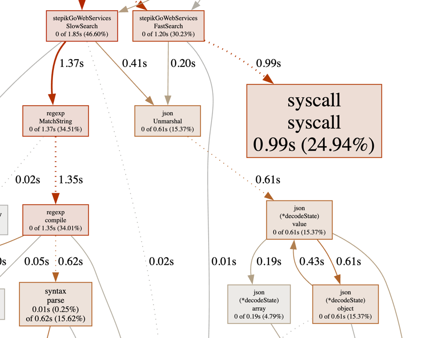

И еще флеймграф:

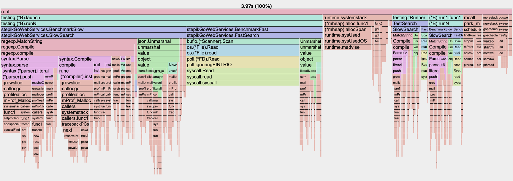

Как видно, снизилась нагрузка на CPU, создаваемая регулярками. Однако теперь выросла нагрузка, создаваемая сисколлами из-за чтения файла построчно

Посмотрим нагрузку построчно в коде:

```text
ROUTINE ======================== stepikGoWebServices.FastSearch in /Users/danilov6083/GolandProjects/stepikGoWebServices/3-profiling/fast_search.go
         0      1.20s (flat, cum) 30.23% of Total
         .          .     14:func FastSearch(out io.Writer) {
         .          .     15:   var file, err = os.Open(filePath)
         .          .     16:   if err != nil {
         .          .     17:           panic(err)
         .          .     18:   }
         .          .     19:
         .          .     20:   var scanner = bufio.NewScanner(file)
         .          .     21:
         .          .     22:   var targetBrowsers = [...]string{"Android", "MSIE"}
         .          .     23:   var seenBrowsers = make(map[string]interface{})
         .          .     24:
         .          .     25:   var reg = regexp.MustCompile("@")
         .          .     26:
         .          .     27:   fmt.Fprintln(out, "found users:")
         .          .     28:
         .      990ms     29:   for i := 0; scanner.Scan(); i++ {
         .          .     30:           var line = scanner.Bytes()
         .       10ms     31:           var user = make(map[string]interface{})
         .          .     32:           //fmt.Printf("%v %v\n", err, line)
         .      200ms     33:           var err = json.Unmarshal(line, &user)
         .          .     34:           if err != nil {
         .          .     35:                   panic(err)
         .          .     36:           }
         .          .     37:
         .          .     38:           var browsers, ok = user["browsers"].([]interface{})
```

Как видно, теперь наибольшую нагрузку действительно создает построчное чтение файла

##### Memory

Далее посмотрим на память:

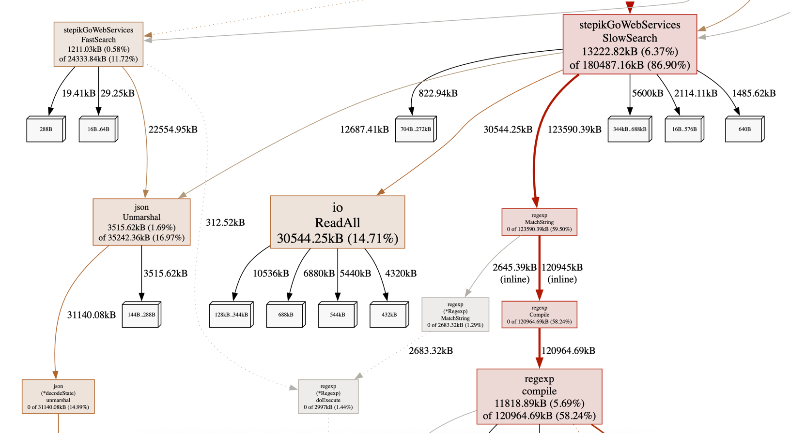

И еще флеймграф:

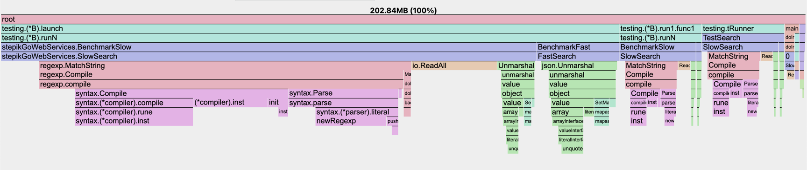

Посмотрим нагрузку построчно в коде:

```text
ROUTINE ======================== stepikGoWebServices.FastSearch in /Users/danilov6083/GolandProjects/stepikGoWebServices/3-profiling/fast_search.go
    1.18MB    23.76MB (flat, cum) 11.72% of Total
         .          .     14:func FastSearch(out io.Writer) {
         .        2kB     15:   var file, err = os.Open(filePath)
         .          .     16:   if err != nil {
         .          .     17:           panic(err)
         .          .     18:   }
         .          .     19:
         .          .     20:   var scanner = bufio.NewScanner(file)
         .          .     21:
         .          .     22:   var targetBrowsers = [...]string{"Android", "MSIE"}
         .          .     23:   var seenBrowsers = make(map[string]interface{})
         .          .     24:
         .    12.12kB     25:   var reg = regexp.MustCompile("@")
         .          .     26:
         .     4.02kB     27:   fmt.Fprintln(out, "found users:")
         .          .     28:
         .       64kB     29:   for i := 0; scanner.Scan(); i++ {
         .          .     30:           var line = scanner.Bytes()
     875kB      875kB     31:           var user = make(map[string]interface{})
         .          .     32:           //fmt.Printf("%v %v\n", err, line)
         .    22.03MB     33:           var err = json.Unmarshal(line, &user)
         .          .     34:           if err != nil {
         .          .     35:                   panic(err)
         .          .     36:           }
         .          .     37:
         .          .     38:           var browsers, ok = user["browsers"].([]interface{})
         .          .     39:           if !ok {
         .          .     40:                   log.Println("Cant cast browsers")
         .          .     41:                   continue
         .          .     42:           }
         .          .     43:
         .          .     44:           var matchedBrowsers = make(map[string]interface{}, len(targetBrowsers))
         .          .     45:
         .          .     46:           for _, browserRaw := range browsers {
         .          .     47:                   var browser, ok = browserRaw.(string)
         .          .     48:                   if !ok {
         .          .     49:                           //log.Println("Cant cast browser to string")
         .          .     50:                           continue
         .          .     51:                   }
         .          .     52:
         .          .     53:                   for _, targetBrowser := range targetBrowsers {
         .          .     54:                           if strings.Contains(browser, targetBrowser) {
         .          .     55:                                   matchedBrowsers[targetBrowser] = struct{}{}
  306.78kB   306.78kB     56:                                   seenBrowsers[browser] = struct{}{}
         .          .     57:                           }
         .          .     58:                   }
         .          .     59:           }
         .          .     60:
         .          .     61:           if len(matchedBrowsers) != len(targetBrowsers) {
         .          .     62:                   continue
         .          .     63:           }
         .          .     64:
         .          .     65:           //log.Println("Android and MSIE user:", user["name"], user["email"])
         .   447.27kB     66:           var email = reg.ReplaceAllString(user["email"].(string), " [at] ")
         .          .     67:
   29.25kB    67.69kB     68:           fmt.Fprintf(out, "[%d] %s <%s>\n", i, user["name"], email)
         .          .     69:   }
         .          .     70:
         .          .     71:   fmt.Fprintln(out, "\nTotal unique browsers", len(seenBrowsers))
         .          .     72:}
```

Как видно, теперь нагрузку на память создает только парсинг жсона

### 2. Системные вызовы

Чтобы уменьшить количество сисколлов, можно попробовать увеличить объем буфера сканера.
К примеру, возьмем 100 кб

#### Бенчмарк

Посмотрим на результаты:

```text
goos: darwin
goarch: arm64
pkg: stepikGoWebServices
cpu: Apple M2 Pro
BenchmarkSlow-12               4         311490990 ns/op        20257788 B/op     182807 allocs/op
BenchmarkFast-12              14          80339875 ns/op         1668221 B/op      45539 allocs/op
PASS
ok      stepikGoWebServices     4.365s
```


##### CPU

Посмотрим на графы:

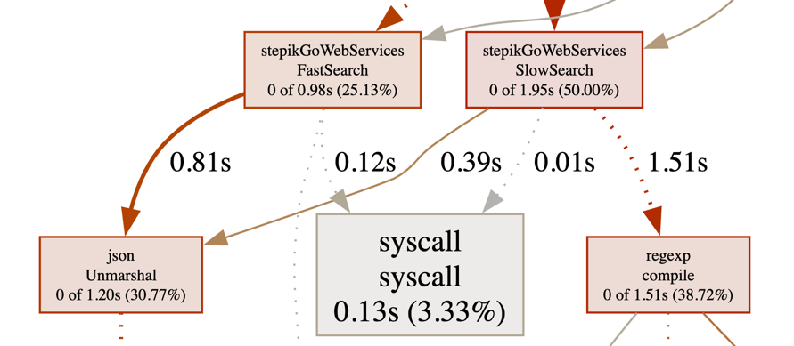

И еще флеймграф:

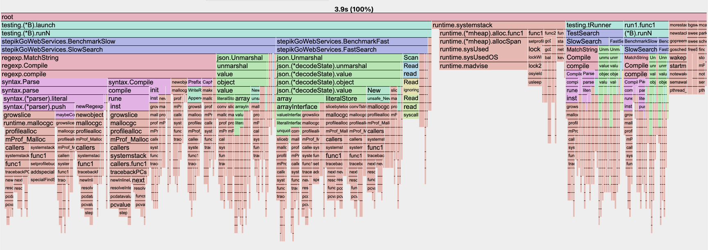

И построчно:

```text
ROUTINE ======================== stepikGoWebServices.FastSearch in /Users/danilov6083/GolandProjects/stepikGoWebServices/3-profiling/fast_search.go
         0      980ms (flat, cum) 25.13% of Total
         .          .     14:func FastSearch(out io.Writer) {
         .       10ms     15:   var file, err = os.Open(filePath)
         .          .     16:   if err != nil {
         .          .     17:           panic(err)
         .          .     18:   }
         .          .     19:
         .          .     20:   var scanner = bufio.NewScanner(file)
         .          .     21:
         .          .     22:   const bufferSize = 100 * 1024 // 100 kb
         .          .     23:   var scannerBuffer = make([]byte, bufferSize)
         .          .     24:   scanner.Buffer(scannerBuffer, bufferSize)
         .          .     25:
         .          .     26:   var targetBrowsers = [...]string{"Android", "MSIE"}
         .          .     27:   var seenBrowsers = make(map[string]interface{})
         .          .     28:
         .          .     29:   var reg = regexp.MustCompile("@")
         .          .     30:
         .          .     31:   fmt.Fprintln(out, "found users:")
         .          .     32:
         .      110ms     33:   for i := 0; scanner.Scan(); i++ {
         .          .     34:           var line = scanner.Bytes()
         .       40ms     35:           var user = make(map[string]interface{})
         .          .     36:           //fmt.Printf("%v %v\n", err, line)
         .      810ms     37:           var err = json.Unmarshal(line, &user)
         .          .     38:           if err != nil {
         .          .     39:                   panic(err)
         .          .     40:           }
         .          .     41:
         .          .     42:           var browsers, ok = user["browsers"].([]interface{})
         .          .     43:           if !ok {
         .          .     44:                   log.Println("Cant cast browsers")
         .          .     45:                   continue
         .          .     46:           }
         .          .     47:
         .          .     48:           var matchedBrowsers = make(map[string]interface{}, len(targetBrowsers))
         .          .     49:
         .          .     50:           for _, browserRaw := range browsers {
         .          .     51:                   var browser, ok = browserRaw.(string)
         .          .     52:                   if !ok {
         .          .     53:                           //log.Println("Cant cast browser to string")
         .          .     54:                           continue
         .          .     55:                   }
         .          .     56:
         .          .     57:                   for _, targetBrowser := range targetBrowsers {
         .          .     58:                           if strings.Contains(browser, targetBrowser) {
         .          .     59:                                   matchedBrowsers[targetBrowser] = struct{}{}
         .          .     60:                                   seenBrowsers[browser] = struct{}{}
         .          .     61:                           }
         .          .     62:                   }
         .          .     63:           }
         .          .     64:
         .          .     65:           if len(matchedBrowsers) != len(targetBrowsers) {
         .          .     66:                   continue
         .          .     67:           }
         .          .     68:
         .          .     69:           //log.Println("Android and MSIE user:", user["name"], user["email"])
         .       10ms     70:           var email = reg.ReplaceAllString(user["email"].(string), " [at] ")
         .          .     71:
         .          .     72:           fmt.Fprintf(out, "[%d] %s <%s>\n", i, user["name"], email)
         .          .     73:   }
         .          .     74:
         .          .     75:   fmt.Fprintln(out, "\nTotal unique browsers", len(seenBrowsers))
```

Видно, что нагрузка на CPU с использованием буфера снизилась на 9 раз. Единственным узким местом остается маршалинг жсона

##### Memory

При этом количество затрачиваемой памяти особо не изменилось:

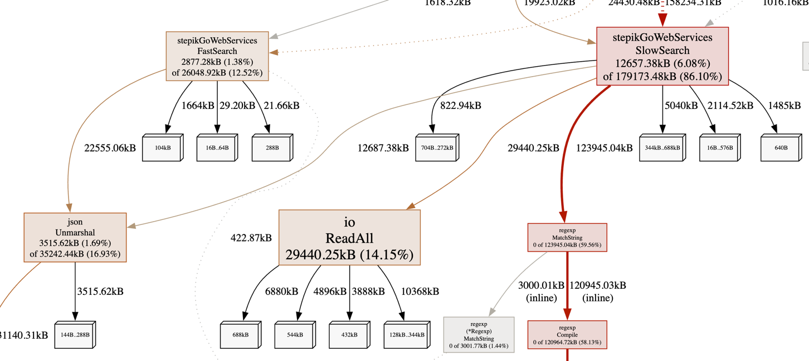

### 3. easyjson

Наконец, добавим библиотеку `easyjson`

#### Бенчмарк


## Итог
